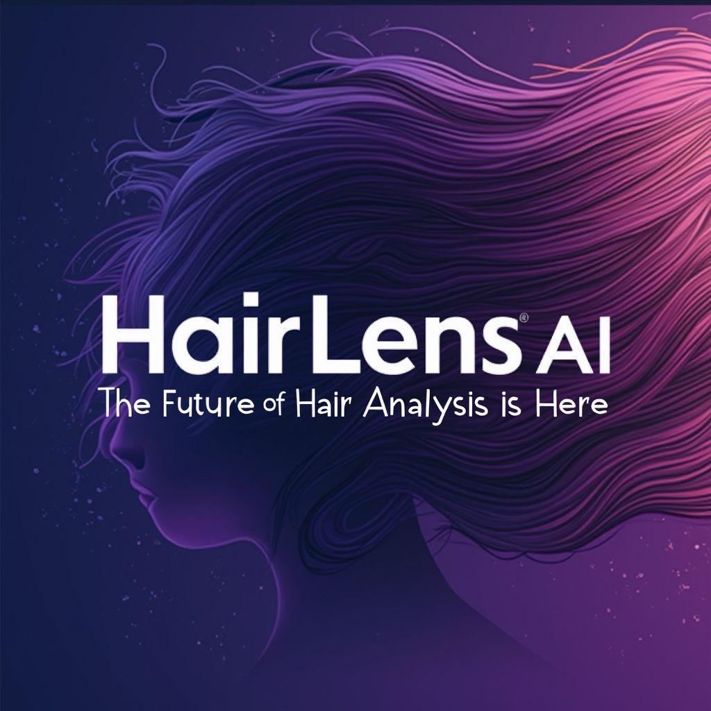

# HairLensAI - Advanced Hair Analysis Platform

> AI-Powered Precision for Perfect Hair Care

HairLensAI is a cutting-edge platform that leverages artificial intelligence to provide detailed hair and scalp analysis, offering personalized recommendations for optimal hair health.

## 🚀 Features

- **AI-Powered Analysis**: Advanced image processing for detailed hair diagnostics
- **Real-Time Results**: Instant analysis with comprehensive metrics
- **Personalized Insights**: Tailored recommendations based on individual hair characteristics
- **Health Tracking**: Monitor hair health progress over time
- **Professional Metrics**: Detailed analysis including porosity, density, and growth patterns

## 🛠️ Technical Stack

- **Frontend**: React, TypeScript, Vite
- **Styling**: Tailwind CSS, shadcn/ui
- **AI Integration**: Google Gemini API
- **Data Visualization**: Chart.js, React-Chartjs-2
- **State Management**: React Hooks
- **Toast Notifications**: Sonner

## 🏃‍♂️ Getting Started

💡 How It Works
Upload a photo of your hair/scalp
Our AI analyzes multiple characteristics:
Hair type and texture
Scalp condition
Growth patterns
Density and thickness
Overall health metrics
Receive detailed analysis and personalized recommendations

📈 Current Status
Version: 1.0.0 (Beta)
Stage: Production-Ready Prototype
Roadmap
[ ] Enhanced AI analysis capabilities
[ ] Multi-image comparison
[ ] Progress tracking dashboard
[ ] Mobile application
[ ] Professional stylist integration
👨‍💻 Creator
Usman Yousaf

LinkedIn: /in/usman9999
Book a Consultation: topmate.io/deepdive
Portfolio: use1.link/usman
🤝 Contributing
We welcome contributions! Please see our Contributing Guidelines for details.

📄 License
This project is licensed under the MIT License - see the LICENSE file for details.

🙏 Acknowledgments
Google Gemini for AI capabilities
shadcn/ui for component library
Our beta testers and early adopters
For support, contact us at carelessinbar@icloud.com
